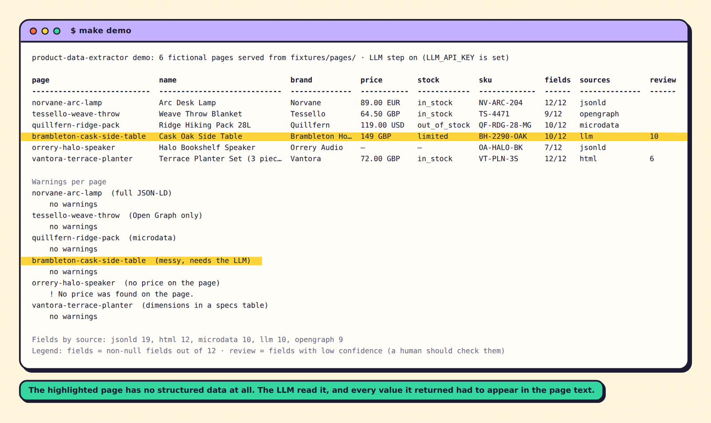

# product-data-extractor

  

**Paste a product page URL, get clean structured product data back, and optionally auto-fill a Google Sheets row.** It works across many different websites by reading the standard markup shops already publish, and it never invents a value: anything it cannot find is `null`.

<!--
  DEMO GIF PLACEHOLDER
  Record `make demo` (or the Google Sheets flow) and save it as docs/demo.gif, then replace this comment with:
  
-->
> **Demo GIF: coming soon.** Until then, this is the real output of `make demo` with an LLM key set (see [Quickstart](#quickstart)):



Five of the six pages are read from their own markup (JSON-LD, Open Graph, microdata, or an HTML specs table). The highlighted page has none, so only the LLM fallback can read it, and each value it returned had to appear in the page text. The page with no price on it keeps `price` empty and says so in a warning.

## Contents

[How it works](#how-it-works) · [Quickstart](#quickstart) · [API](#api) · [Google Sheets](#google-sheets) · [Configuration](#configuration) · [Safety and etiquette](#safety-and-etiquette) · [Limitations](#limitations) · [Development](#development)

## How it works

```mermaid
flowchart LR
    A["POST /extract<br/>{url}"] --> B["Validate URL<br/>resolve DNS, block<br/>private addresses"]
    B --> C["robots.txt, per-domain<br/>rate limit, fetch<br/>(size and time caps)"]
    C --> L1["1. schema.org JSON-LD"]
    L1 --> L2["2. Open Graph /<br/>product meta tags"]
    L2 --> L3["3. Microdata / RDFa"]
    L3 --> L4["4. HTML heuristics"]
    C -. "almost no static text<br/>and RENDER_JS=true" .-> R["6. Render with Playwright<br/>and run 1-4 again"]
    R -.-> L1
    L4 --> Q{"fields still<br/>missing?"}
    Q -- "yes, and an LLM key is set" --> M["5. LLM fallback<br/>(values must appear<br/>in the page text)"]
    Q -- no --> O
    M --> O["ProductData JSON<br/>per-field source and confidence"]
```



The layers run from cheapest and most reliable to least, and **the first layer to supply a field wins**:

| # | Layer | Reads | Confidence it reports |
|---|---|---|---|
| 1 | `jsonld` | schema.org `Product` in `<script type="application/ld+json">`: `@graph`, arrays, `@id` references, `Offer` / `AggregateOffer`, nested `brand` objects | high |
| 2 | `opengraph` | `og:*` and `product:*` meta tags | medium |
| 3 | `microdata` | `itemscope` / `itemprop` markup, and RDFa Lite (`typeof` / `property`) | high |
| 4 | `html` | the main heading, a price element, a stock-status element, a product image, and labelled rows in specs tables / definition lists | medium for labelled specs rows, low for the rest |
| 5 | `llm` | only the fields still empty, from the cleaned page text | low |
| 6 | (render) | the same layers on a Playwright-rendered page, for near-empty JavaScript pages | as above |

Rules that keep the output honest:

- **A field that is not found is `null`**, and so are its `source_method` and `confidence`. Nothing is guessed: the page title is never used as a product name, a bare `$` does not become `USD`, an ambiguous `1.299` does not become a price, and free text is never scanned for numbers.
- **Disagreement is reported.** If JSON-LD and Open Graph give different prices, the first layer's value is used, its confidence drops one step, and a warning names both values.
- **Ambiguity lowers confidence.** Several `Product` nodes, several offers with different prices, or a price range (the lowest price is used) all produce a warning.
- **The LLM cannot invent values.** Its reply is validated against a Pydantic model, then every value must literally occur in the page text it was shown (a price must sit next to a currency symbol or code, a SKU must match as a whole code). Anything else is rejected with a warning. Accepted values are still marked `low` so a person reviews them.

## Quickstart

### Docker

```bash
git clone https://github.com/joel819/product-data-extractor.git && cd product-data-extractor
docker compose up --build
# API on http://localhost:8000, interactive docs on http://localhost:8000/docs
```

To try the offline demo in the container instead: `docker compose --profile demo run --rm demo`.

JavaScript rendering needs a browser in the image: `INSTALL_PLAYWRIGHT=true docker compose up --build`, then set `RENDER_JS=true` in `.env`.

### Plain Python (3.11+)

```bash
git clone https://github.com/joel819/product-data-extractor.git && cd product-data-extractor
make install      # creates .venv and installs dependencies
make demo         # extracts the six fictional fixture pages and prints a table (no internet, no keys)
make run          # API on http://localhost:8000, docs at /docs
make test         # offline test suite (no keys, no network)
```

### The demo

`make demo` serves six invented product pages from `fixtures/pages/` on a local port and extracts each through the real fetcher:

| Page | What it exercises |
|---|---|
| `norvane-arc-lamp` | full JSON-LD (`@graph`, nested brand, offer, dimensions, finish) |
| `tessello-weave-throw` | Open Graph tags only (and a decoy price elsewhere on the page) |
| `quillfern-ridge-pack` | microdata with nested brand and offer scopes |
| `brambleton-cask-side-table` | messy prose with no markup: only the LLM fallback can read it |
| `orrery-halo-speaker` | a product with no price anywhere: `price` stays `null` and a warning says so |
| `vantora-terrace-planter` | dimensions, finish and material inside a specs table; a struck-through old price is ignored |

With no `LLM_API_KEY` the LLM step is skipped: the messy page returns all-`null` fields with a warning, rather than a guess. Set `LLM_API_KEY` to see it filled in (the demo makes real LLM calls if a key is present).

## API

`POST /extract` with `{"url": "..."}` returns a `ProductData` object. `GET /health` reports the configuration (never secrets). Interactive docs are at `/docs`.

```bash
curl -s -X POST http://localhost:8000/extract \
  -H 'content-type: application/json' \
  -d '{"url": "https://shop.example.com/products/terrace-planter-set"}'
```

Response (this is the real output of the extractor for the bundled `vantora-terrace-planter` fixture page, which has no structured data, so every field comes from the HTML layer):

```json
{
  "url": "https://shop.vantora.example/products/terrace-planter-set",
  "name": "Terrace Planter Set (3 pieces)",
  "brand": "Vantora",
  "sku": "VT-PLN-3S",
  "price": "72.00",
  "currency": "GBP",
  "availability": "in_stock",
  "description": "Three powder-coated steel planters that nest together for storage.",
  "image_url": "https://shop.vantora.example/images/terrace-planters.jpg",
  "dimensions": "Large 45 × 45 × 50 cm; medium 38 × 38 × 42 cm; small 30 × 30 × 34 cm",
  "colour": "Sage",
  "finish": "Powder-coated, matte",
  "material": "Galvanised steel",
  "source_method": {
    "name": "html",
    "brand": "html",
    "sku": "html",
    "price": "html",
    "currency": "html",
    "availability": "html",
    "description": "html",
    "image_url": "html",
    "dimensions": "html",
    "colour": "html",
    "finish": "html",
    "material": "html"
  },
  "confidence": {
    "name": "low",
    "brand": "medium",
    "sku": "medium",
    "price": "low",
    "currency": "low",
    "availability": "low",
    "description": "low",
    "image_url": "low",
    "dimensions": "medium",
    "colour": "medium",
    "finish": "medium",
    "material": "medium"
  },
  "warnings": []
}
```

Notes on the schema:

- `price` is a string (`"72.00"`) so no precision is lost; `currency` is an ISO 4217 code. `availability` is one of `in_stock`, `out_of_stock`, `preorder`, `backorder`, `limited`, `discontinued`, or the page's own wording if it matches none.
- `dimensions` is kept exactly as written on the page (units are not converted). When it comes from JSON-LD `width`/`height`/`depth` it is composed as `W 28 cm × H 46 cm × D 17 cm`.
- `source_method` is one of `jsonld`, `opengraph`, `microdata` (also used for RDFa Lite), `html`, `llm`, or `null`. `confidence` is `high`, `medium`, `low`, or `null`.
- Responses are cached per URL (header `X-Cache: HIT` or `MISS`).

Errors are always `{"error": "<code>", "message": "<text>"}`:

| HTTP | `error` | When |
|---|---|---|
| 400 | `blocked_address` | the URL (or a redirect, or a DNS answer) points at a private, loopback, link-local or reserved address |
| 401 | `unauthorized` | `API_KEY` is set on the server and `X-API-Key` is missing or wrong |
| 403 | `blocked_by_robots` | robots.txt disallows the URL (or answers with a server error) |
| 422 | `invalid_url` / `invalid_request` / `not_html` / `page_too_large` | not an `http(s)` URL, bad body, not an HTML page, or over `MAX_PAGE_BYTES` |
| 502 | `fetch_failed` | the site answered with an error, was unreachable, or redirected too many times |
| 504 | `fetch_timeout` | the site took too long |

## Google Sheets

[`apps_script/Code.gs`](apps_script/Code.gs) turns a spreadsheet into a front end: paste a product URL into a column (default `H`) and the same row is filled with the extracted fields, the image appears via `=IMAGE()`, and every **low-confidence cell is highlighted yellow** for human review. Fields not found stay empty.

- Setup is one `CONFIG` block at the top of the script (API URL, optional key, URL column, column mapping) and a one-time "install trigger" step. Everything runs in your own Google account against your own API.
- Step-by-step guide, the expected sheet layout and troubleshooting: [`apps_script/README.md`](apps_script/README.md).
- The API must be reachable from the internet, because Apps Script runs on Google's servers (`localhost` will not work).

## Configuration

All settings are environment variables (or a `.env` file; see [`.env.example`](.env.example)). Everything is optional.

| Variable | Default | Meaning |
|---|---|---|
| `USER_AGENT` | `product-data-extractor/0.1 (+repo URL)` | sent with every request |
| `REQUEST_TIMEOUT_SECONDS` | `15` | per request; a whole fetch (with redirects) is capped at twice this |
| `MAX_PAGE_BYTES` | `2000000` | larger pages are rejected while streaming |
| `MAX_REDIRECTS` | `5` | each hop is validated again |
| `RESPECT_ROBOTS_TXT` | `true` | |
| `PER_DOMAIN_MIN_INTERVAL_SECONDS` | `1.0` | minimum gap between requests to the same host |
| `ALLOW_PRIVATE_NETWORKS` | `false` | leave off. Only the local demo and tests turn it on |
| `CACHE_TTL_SECONDS` | `3600` | `0` disables the cache |
| `CACHE_MAX_ENTRIES` | `1000` | least recently used entries are evicted |
| `API_KEY` | empty | if set, `POST /extract` requires `X-API-Key` |
| `LLM_API_KEY` | empty | empty means the LLM step is skipped |
| `LLM_BASE_URL` | `https://api.groq.com/openai/v1` | any OpenAI-compatible API |
| `LLM_MODEL` | `openai/gpt-oss-120b` | |
| `LLM_TIMEOUT_SECONDS` | `30` | |
| `LLM_MAX_INPUT_CHARS` | `12000` | page text sent to the model is truncated to this |
| `RENDER_JS` | `false` | render near-empty pages with Playwright (needs `requirements-render.txt` and `playwright install chromium`) |
| `RENDER_MIN_TEXT_CHARS` | `200` | render only if the static page has less visible text than this |
| `RENDER_TIMEOUT_SECONDS` | `20` | |
| `RENDER_EXECUTABLE_PATH` | empty | use an existing Chromium/Chrome instead of Playwright's download |

## Safety and etiquette

- **SSRF protection.** A URL is only fetched if, *after DNS resolution*, every address it points at is public. Loopback, private, link-local (including cloud metadata addresses), CGNAT, multicast and reserved ranges are refused, including IPv4 addresses hidden inside IPv6 (`::ffff:127.0.0.1`, 6to4, Teredo, NAT64) and odd spellings such as `2130706433` or `0x7f.1`. Only `http` and `https` are allowed and URLs with embedded credentials are refused. The connection is then made to the *validated IP* (with the original hostname in `Host` and SNI), so a second DNS answer cannot redirect it, and redirects are followed by hand so every hop is validated again. Proxy settings from the environment are ignored for the same reason.
- **robots.txt** is obeyed with RFC 9309 matching (most specific user-agent group, longest path rule wins). A 4xx robots.txt means no rules; a 5xx means the page is not fetched; a connection or TLS failure is reported as `fetch_failed`.
- **Politeness.** A clear `User-Agent`, a per-domain minimum interval, a timeout, a streaming page-size cap (applies to decompressed bytes) and a URL cache.
- **Optional `API_KEY`** for the HTTP endpoint, compared in constant time.

## Limitations

Being specific about what this does not do:

- **One page per request.** It does not crawl, follow pagination, or read category or search-result pages.
- **It does not get around bot protection.** If a shop answers 403, shows a CAPTCHA or a "verify you are human" page, you get `fetch_failed` or an empty result. That is deliberate.
- **JavaScript-only pages** need the optional Playwright step. The browser's own DNS lookups are not pinned the way the static fetch is: each browser request is checked against the SSRF rules before it is sent, but a hostile DNS server could still change its answer between that check and the browser's connection.
- **LLM verification proves a value is in the page text, not that it is the right value.** For example, an old crossed-out price also occurs in the text; the prompt asks for the current one, and every LLM value is marked `low` for a human to check. A page can also contain text that tries to steer the model; verification only guarantees nothing is added that the page does not contain.
- **Prices and currencies are conservative.** A bare `$` or `¥` gives no currency (ambiguous). `1.299` is refused (thousands separator or three decimals?). Product groups with variants do not get per-variant prices; an `AggregateOffer` range reports the lowest price, with a warning.
- **The HTML heuristics are English-oriented** (spec labels such as "Colour", "Dimensions", "SKU"; stock wording such as "In stock").
- **The cache is in memory**, per process: it is lost on restart and not shared between workers. There is no per-client rate limiting; put the API behind a gateway if it is exposed publicly, and set `API_KEY`.
- **Legal and terms-of-service questions are yours.** Obeying robots.txt is not the same as permission to copy a site's data.
- **Apps Script** is tested against mocks of Google's services, not against real Google quotas and authorisation screens.

## Development

```bash
make install     # virtualenv + dev dependencies
make test        # pytest (also runs the Node-based Apps Script tests if Node is installed)
make demo        # the offline demo
RUN_PLAYWRIGHT_TESTS=1 python -m pytest tests/test_render_playwright.py   # opt-in browser tests
```

The test suite is offline: DNS is faked, HTTP uses in-memory transports, and the LLM is a fake chat API. It covers each extraction layer, the merge rules, the "never guess" behaviour (garbage input produces nulls, not errors), SSRF blocking (including redirects and mixed DNS answers), robots.txt, rate limiting, size and time caps, the cache, the API and the Apps Script logic.

```
product_extractor/
  api.py            FastAPI app (POST /extract, GET /health)
  service.py        fetch -> extract -> (render) -> (LLM) -> cache
  pipeline.py       layer order and merge rules
  extractors/       jsonld, opengraph, microdata (+RDFa Lite), html, llm, shared schema.org reader
  fetcher.py        pinned, redirect-validating, size-capped HTTP fetch
  security.py       SSRF validation        robots.py   RFC 9309 matching     ratelimit.py   per-domain spacing
  normalize.py      prices, currencies, availability
  schema.py         ProductData (Pydantic)  config.py   settings              cache.py       TTL cache
  render.py         optional Playwright rendering
fixtures/pages/     six fictional product pages (invented brands) + robots.txt
scripts/demo.py     local fixture server + results table
apps_script/        Code.gs, setup guide, Node tests
```

## Licence

MIT. See [LICENSE](LICENSE). The brands and products in `fixtures/` are invented.
